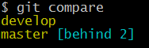
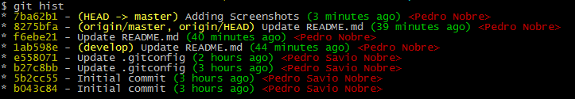
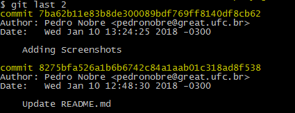

# my-gitconfig
Personal aliases and configurations of my ".gitconfig" file.

## Section [alias]

### Comparing branches ahead/behind
Use `git compare` to see how many commits are ahead/behind.


###### Examples:

```
$ git compare //Comparing all branches

$ git compare . //Comparing current branch

$ git compare <branch-name> //Comparing specific branch
```

###### Screenshots:


### History of commits
Use `git hist` to see the history of commits related to the current branch.

###### Examples:

```
$ git hist //Show history (all commits) of branch

$ git hist <n> //Show history ("n" commits) of branch
```

###### Screenshots:


### The last commits
Use `git last` to show the last commits you want.

###### Examples:

```
$ git last //The last commit

$ git last <n> //The last("n") commits
```

###### Screenshots:


### Starting your branch before code
The `git start` command is used to update your branch with no necessary to check commits behind or ahead.

###### Examples:

```
$ git start //Start current branch

$ git start <branch-name> //Start specific branch
```

### Unlock your repository
`index.lock` file indicates to other Git processes that the repository is locked for editing. Some Git errors create this file and don't remove itself. The `git unlock` command removes the file to turn Git repository available again.

###### Examples:

```
$ git unlock //Unlock repository
```

### Unstage files
Use `git unstage` to remove files from stage area.

###### Examples:

```
$ git unstage //Unstage all files

$ git unstage <file> //Unstage specific file
```


